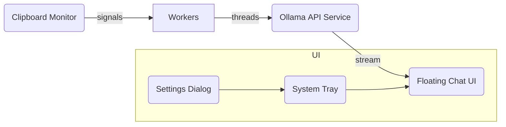

<p align="center">
  
</p>

# Clipboard AI

<p align="center">
  <strong>Turn copy‑paste into super‑powers.</strong><br>
  Analyse, summarise and transform text <em>and</em> images in your clipboard using local LLMs – in one hot‑key – without sending your data anywhere.
</p>

<p align="center">
  <a href="https://github.com/LikithMeruvu/Clipboard_ai/actions"></a>
  <a href="https://github.com/LikithMeruvu/Clipboard_ai/releases"></a>
  <a href="https://github.com/LikithMeruvu/Clipboard_ai/stargazers"></a>
  <a href="https://github.com/LikithMeruvu/Clipboard_ai/blob/main/LICENSE"></a>
</p>

> **TL;DR** – Clipboard AI sits in your system tray, watches your clipboard and—when you hit a hot‑key or let it auto‑trigger—pipes the content through local LLMs served by **Ollama**. The result (summary, explanation, caption, code refactor, whatever) streams back in a sleek floating chat window that remembers context.

---

## Table of Contents

1. [Key Features](#key-features)
2. [Demo](#demo)
3. [How It Works](#how-it-works)
4. [Installation](#installation)
5. [Usage](#usage)
6. [Configuration](#configuration)
7. [Supported Models](#supported-models)
8. [Security & Privacy](#security--privacy)
9. [Troubleshooting](#troubleshooting)
10. [Roadmap](#roadmap)
11. [Contributing](#contributing)
12. [License](#license)
13. [Credits](#credits)

---

## Key Features

* **System‑tray daemon** – lives quietly in Windows & macOS menu bars; built with PyQt6 and `QSystemTrayIcon`.
* **Global hot‑keys** – defaults:

  * `Ctrl + Shift + U` (text)
  * `Ctrl + Shift + O` (image)
  * `Ctrl + Shift + .` (notes)
    *(all user‑configurable).*
* **Auto vs Manual** – let Clipboard AI auto‑process every copy or only when you press a key.
* **Multimodal** – processes plain text, rich text and images (captured or files) with vision‑capable models.
* **Contextual chat** – follow‑up questions stay in‑memory so you can iterate without re‑copying.
* **100 % Local** – powered by [Ollama](https://ollama.ai) models: no cloud calls, so your data never leaves the machine.
* **Cross‑platform packaging** – single‑file executables via PyInstaller (Windows) and py2app (macOS) plus Inno Setup installer.
* **Extensible** – modular worker threads; just swap models or add new prompts to extend functionality.
* **Private config** – JSON settings stored in platform‑correct user config dir (thanks `appdirs`).


---

## How It Works



1. **ClipboardMonitor** watches clipboard via Qt’s `QClipboard` and emits signals when it detects new text/image.
2. **Worker threads** (TextWorker & ImageWorker) call Ollama’s REST endpoints, streaming tokens back.
3. **FloatingDialog** displays a thinking indicator then streams the response; users can ask follow‑up questions that keep context.
4. **SystemTray** menu lets you pause, switch Auto/Manual mode, open Settings, or quit.

---

## Installation

### Prerequisites

| Dependency | Minimum  | Notes                                                 |
| ---------- | -------- | ----------------------------------------------------- |
| **Python** |  3.8     | Only needed if installing from source                 |
| **Ollama** | latest   | `brew install ollama` / Windows MSI / Docker          |
| **GPU**    | Optional | CPU works; GPU + 8 GB VRAM recommended for >7B models |

### Grab a Release (recommended)

* 🪟 **Windows 10+** → `ClipboardAI-Setup-x.y.z.exe`
* 🍎 **macOS 12+** → `Clipboard AI-x.y.z.dmg`

Download from the **[Releases](https://github.com/LikithMeruvu/Clipboard_ai/releases)** page, install, run. The tray icon appears on first launch.

### Build from Source

```bash
git clone https://github.com/LikithMeruvu/Clipboard_ai.git
cd Clipboard_ai
python -m venv venv && source venv/bin/activate      # Windows: venv\Scripts\activate
pip install -e .
ollama pull gemma3:latest        # or deepseek-r1:8b, llama3, etc.
clipboard-ai                      # launch
```

---

## Usage

| Action                         | Default Shortcut   | What Happens                                          |
| ------------------------------ | ------------------ | ----------------------------------------------------- |
| **Process latest copy**        | `Ctrl + Shift + U` | Opens dialog; sends clipboard text to AI              |
| **Add notes to last copy**     | `Ctrl + Shift + .` | Opens modal for extra instructions                    |
| **Analyse image in clipboard** | `Ctrl + Shift + O` | Shows preview → enter question → get caption/analysis |
| **Toggle Auto/Manual**         | Tray → *Auto‑mode* | Auto processes every new copy                         |
| **Pause / Resume monitoring**  | Tray → *Pause*     | Suspends clipboard hooks                              |

Hot‑keys are editable in **Tray → Settings**.

---

## Configuration

A JSON file is created on first run at:

* **Windows** `%APPDATA%\clipboard_ai\config.json`
* **macOS** `~/Library/Application Support/clipboard_ai/config.json`
* **Linux** `~/.config/clipboard_ai/config.json`

Example:

```jsonc
{
  "processing_mode": "manual",
  "hotkey": "ctrl+shift+u",
  "notes_hotkey": "ctrl+shift+.",
  "image_hotkey": "ctrl+shift+o",
  "selected_model": "gemma3:latest",
  "image_model": "gemma3:latest",
  "ollama_host": "http://localhost:11434",
  "notification_duration": 5000
}
```

---

## Supported Models

| Purpose | Default         | Alternatives                                         |
| ------- | --------------- | ---------------------------------------------------- |
| Text    | `gemma3:latest` | `deepseek-r1:8b`, `llama3`, any GPTQ/gguf text model |
| Vision  | `gemma3:latest` | `llava`, `bakllava`, `clip‑cap`, etc.                |

Pull with:

```bash
ollama pull gemma3:latest
ollama pull deepseek-r1:8b
```

Switch models in **Settings → Model Selection**.

---

## Security & Privacy

Clipboard AI never transmits clipboard data over the internet. All inference happens via Ollama on `localhost`.
No analytics, no telemetry, no 3rd‑party servers. You control the models and the data.

---

## Troubleshooting

| Symptom                        | Fix                                                                    |
| ------------------------------ | ---------------------------------------------------------------------- |
| **“Cannot connect to Ollama”** | Run `ollama serve`; ensure `config.json` points to correct port        |
| **Hot‑key not working**        | Check for collisions with other apps; edit shortcut in Settings        |
| **Large image stalls**         | Images > 4K are down‑scaled automatically; ensure enough RAM/VRAM      |
| **PyInstaller build fails**    | Use Python 3.10+, upgrade PyInstaller, add `--hidden-import=PyQt6.sip` |

---

## Roadmap

* [ ] Linux (Wayland/X11) build & AppImage
* [ ] Clipboard history sidebar
* [ ] Custom prompt templates
* [ ] Plugin SDK for speciality tasks (OCR, code lint, translation)

See the [open issues](https://github.com/LikithMeruvu/Clipboard_ai/issues) for the full backlog.

---

## Contributing

Pull requests are welcome!

1. Open an issue to discuss major changes.
2. Fork → `git checkout -b feat/your-feature`.
3. `pre-commit run --all-files` to pass formatting & lint.
4. Add/adjust unit tests.
5. Submit PR – the CI will run on GitHub Actions.

By contributing you agree to follow our **Contributor Covenant Code of Conduct** (see `CODE_OF_CONDUCT.md`).

---

## License

Clipboard AI is released under the **MIT License** – see [`LICENSE`](LICENSE) for full text.

---

## Credits

| Role        | Name / Project                                   |
| ----------- | ------------------------------------------------ |
| Inspiration | Tom Preston‑Werner’s “README first” philosophy   |
| LLM Runtime | [Ollama](https://ollama.ai)                      |
| GUI Toolkit | [Qt 6](https://www.qt.io) via PyQt6              |
| Badges      | [Shields.io](https://shields.io)                 |
| Icons       | [HeroIcons](https://heroicons.com)               |
| Maintainer  | [@LikithMeruvu](https://github.com/LikithMeruvu) |

<p align="center"><em>Clipboard AI – because copy‑paste deserves super‑powers.</em></p>
